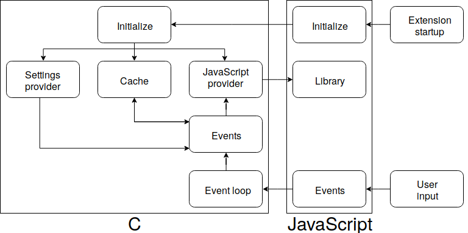
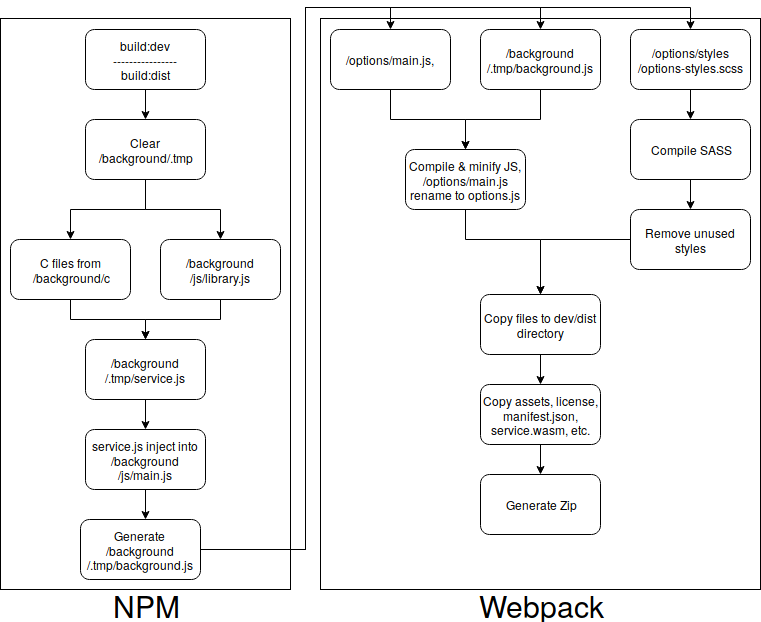

# Firefox Tab Suspender  
  

 

 |
:---: |
59+ |

_Firefox Tab Suspender_ is an open source (only source code, see license) extension for Firefox Browser 59+.

Extension's target are people who use older computers or just want to reduce browser's ram usage. For this reasons I strive to make _Firefox Tab Suspender_ lightweight and performant as much as it is possible.

After install, extension will suspend unused cards according to user's settings.

Thanks to author of Chrome's
[The Great Suspender](https://github.com/deanoemcke/thegreatsuspender). Notice that _Firefox Tab Suspender_ at the base is highly inspired by his work.

#### Development Roadmap

Public development roadmap is avaible under this **[link](https://trello.com/b/BbbjVfl4/firefox-tab-suspender-public)**.

Task list for contributors is in plans, for now this list should be enough.

#### Structure

Simplified project structure.

#### Build process

**Details worth to pay attention:**
* Generating big amounts of styles in development has no cost in production because of that styles are cleaned up in build process. Final stylesheet contains only used styles
* CSS convention is highly based on **SUIT** naming and organizing convention
* If it is possible - instead of writing single style's class, generate full spectrum of possibilities
* WASM is injected after user settings load in place of **//= ../.tmp/service.js** comment
* There is no need of multiply or copying images into src folder, final package contains everything in one folder

#### Informations for contributors
if you are interested in contributing and developmenting of extension there are some tips:

  * Always request merge to **'develop'** branch - **not to 'master' branch!**
  * Work on branches which has prefix **'FTS-'** and number as suffix like **'FTS-3'**, exceptions are any small patches or small bugfixes
  * List of tasks you can find under this **[link](https://trello.com/b/BbbjVfl4/firefox-tab-suspender-public)**
  * In case of any questions make issue or feel free and ask in way that you prefer

#### Contributors

 

-----
